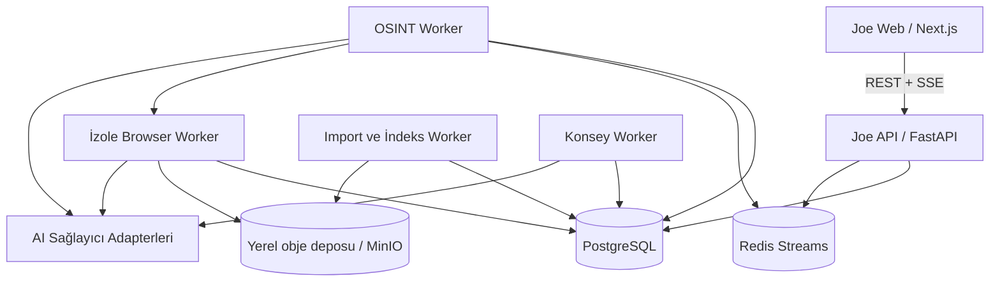

# Joe — mevcut durum, hedef mimari ve yapılacaklar

> Son güncelleme: 20 Temmuz 2026  
> Bu belge bir sonraki geliştirici/yapay zekâ için hem devir notu hem uygulama
> sözleşmesidir. Belgeyi hazırlayan oturumda kod değiştirilmemiştir. Kullanıcı yeni
> geliştiriciye `Bu dosyayı oku ve yap` dediğinde, geliştirici mevcut kodu önce
> denetleyip aşağıdaki planı gerçek veriyi koruyarak uygulamaya başlamalıdır;
> belgede zaten kararlaştırılan konuları yeniden genel fikir aşamasına döndürmemelidir.

## 1. Ürün vizyonu

Joe, yerel çalışan ve vaka merkezli iki ayrı çalışma alanından oluşur:

1. **OSINT / Keşif:** Kullanıcı adı veya tam ad üzerinden açık kaynakları tarar,
   bulunan gerçek bağlantıları kaydeder, sayfaları inceler ve doğrulama gerekçesi
   üretir.
2. **Kuramsal Analiz:** Kullanıcının verdiği metin, ekran görüntüsü, dosya,
   Instagram/WhatsApp arşivi veya seçilmiş kanıtları kuramsal bir AI konseyinde
   değerlendirir.

`Vaka`, bu iki alanın ortak çalışma zarfıdır; fakat OSINT bulguları Analiz alanına
**kendiliğinden akmamalıdır**. Kullanıcı hangi bulgunun veya arşiv kesitinin
analize aktarılacağını açıkça seçmelidir.

Joe klinik tanı, tehlikelilik tahmini, suçluluk çıkarımı, politik tercih tahmini,
işe/krediye uygunluk puanı veya otomatik sosyal puan üretmez. Kuramsal yorumlar
kişinin değişmez gerçeği gibi sunulmaz.

---

## 2. Şu anda projede çalışanlar

### 2.1 Yerel altyapı

- Web tabanlı, yüzde 100 Türkçe Next.js arayüzü.
- FastAPI backend.
- PostgreSQL kalıcı veritabanı.
- Redis servisi hazır; henüz canlı olay akışının merkezi olarak kullanılmıyor.
- MinIO servisi hazır.
- Veritabanı tabanlı kalıcı worker işleri.
- Docker Compose ile yerel kurulum.
- Web: `http://localhost:4177`
- API: `http://localhost:8000`
- Sağlık kontrolü: `http://localhost:8000/api/v1/health`
- Portlar varsayılan olarak yalnız `127.0.0.1` üzerinde yayınlanıyor.

### 2.2 Arayüz

- Eski tanıtım/“nasıl kullanılır” ana ekranı kaldırıldı.
- Ana ekran `Vaka Masası` oldu.
- Görsel logo kaldırıldı; marka yalnız küçük harfle `joe` yazıyor.
- OSINT ve Analiz ayrı ana menüler.
- Vakalar ve AI sağlayıcıları ayrı ekranlarda.
- Arayüz mobil kırılımlara sahip.

### 2.3 OSINT

- Kullanıcı adı veya tam adla çalışma başlatılabiliyor.
- Vaka seçilmezse OSINT çalışması otomatik vaka açıyor.
- Kullanıcı adı sorgusunda aşağıdaki bağlayıcılar otomatik çalışıyor:
  - Sherlock
  - Maigret
  - WhatsMyName
  - Açık profil dizinleri: GitHub, GitLab, Codeberg ve uygun sorgularda
    Stack Overflow
- Kullanıcı bağlayıcı/mod/hız seçmiyor; uygun bağlayıcıların tamamı çalışıyor.
- Bağlayıcılar eşzamanlı çalışıyor.
- Hızlı biten bağlayıcıların sonuçları uzun Maigret taraması bitmeden veritabanına
  kademeli yazılabiliyor.
- Aynı profil URL'si birden fazla kaynakta bulunursa URL tekilleştiriliyor;
  `sources` alanında bütün kaynaklar korunuyor.
- Her bulgu gerçek `profile_url` bağlantısıyla dönüyor.
- Eşleşmeler `doğrulanmadı` aday statüsünde; aynı kullanıcı adının aynı kişi
  olduğu otomatik kabul edilmiyor.
- Harici kaynak hataları başarılı sonuç gibi gizlenmiyor.
- Worker loglarında sorgulanan ad/kullanıcı adı içeren tek tek HTTP URL'leri
  yazdırılmıyor.

Gerçek entegrasyon doğrulamasında kamuya açık `sherlock-project` hesabı
kullanıldı. Dört ana bağlayıcı da tamamlandı, sonuçlar kademeli göründü ve her
bulguda açılabilir bağlantı bulundu. Anonim GitHub API kota hatası oluştuğunda bu
hata açıkça `source_failed` olarak kaydedildi.

### 2.4 Analiz konseyi

- Mevcut Analiz ekranı serbest metni ana/zorunlu girdi gibi gösteriyor. Bu,
  hedeflenen ürün akışı değildir ve düzeltilmelidir.
- Kullanıcı hızlı/derin/kolay/kolektif analiz modu seçmiyor.
- Her oturum tek ve tam protokolü yürütüyor:
  1. Bağımsız persona görüşleri
  2. Çapraz sorgu/itiraz
  3. Görüş revizyonu
  4. Nötr ortak sentez
- 13 kuramsal mercek mevcut:
  - Sigmund Freud
  - Carl Gustav Jung
  - Melanie Klein
  - Alfred Adler
  - Donald Winnicott
  - Wilfred Bion
  - Karen Horney
  - Wilhelm Reich
  - Erich Fromm
  - Jacques Lacan
  - Julia Kristeva
  - Slavoj Žižek
  - Michel Foucault
- Personalar tarihsel kişiyi taklit etmiyor; kuramsal mercek olarak çalışıyor.
- Her analiz iddiası var olan `K1`, `K2` gibi kanıt kimliklerine dayanmak zorunda.
- Geçersiz kanıt kimliği, kanıtsız iddia ve teşhis dili için deterministik denetim
  var.
- AI sağlayıcısı yoksa veya başarısızsa sahte fallback analiz üretilmiyor.
- 23 bildirimsel AI sağlayıcı profili ve OpenAI uyumlu özel endpoint desteği var.
- Persona bazında farklı sağlayıcı bağlantısı atanabiliyor.
- Secret değerleri istemciye geri gönderilmiyor.

Hedef davranışta analiz başlatmak için metin yapıştırmak zorunlu değildir. Metin,
ekran görüntüsü, yüklenen belge, vaka kanıtı, Instagram/WhatsApp kesiti ve
indekslenmiş yerel dizin/corpus eşit düzeyde kaynak türleridir. Kullanıcı bunlardan
en az birini açıkça seçer; sistem boş kaynakla analiz başlatmaz.

### 2.5 Dosya ve dizin inceleme

- Metin, JSON, ZIP, PDF, DOCX ve ekran görüntüsü yüklenebiliyor.
- Görüntüler için Türkçe/İngilizce OCR var.
- ZIP path traversal, şifreli üye, dosya sayısı ve genişleme sınırları korunuyor.
- HTTP dosya yükleme sınırı güvenlik amacıyla hâlâ mevcut.
- Büyük veri için güvenli alternatif olarak Docker'a salt-okunur yerel dizin
  bağlama eklendi.
- Dizin dosyaları Joe veri alanına kopyalanmadan indeksleniyor.
- Dizin dışına çıkma, mutlak yol ve sembolik bağlantı kaçışı engelleniyor.
- İndeks içinde sözcük tabanlı arama yapılabiliyor.
- Bulunan gerçek kesitler Analiz kaynağına açık kullanıcı eylemiyle aktarılabiliyor.

Mevcut yerel `.env`, izin verilen şu dizini salt-okunur bağlıyor:

```text
C:/datas/server/c-arşiv/data
```

Gerçek Instagram `comments` alt diziniyle yapılan kontrolde 2 dosya ve 2 belge
hatasız indekslendi. İçerik terminale basılmadı.

### 2.6 Son doğrulama durumu

- `npm run lint`: başarılı.
- `npm test`: 2/2 başarılı.
- Backend pytest: 15/15 başarılı.
- `npm run build`: başarılı.
- `docker compose up -d --build`: başarılı.
- API sağlık kontrolü: sağlıklı.
- Salt-okunur dizin kökünün dışına çıkma isteği: `422` ile reddedildi.
- Docker yeniden kurulunca vaka, corpus ve OSINT kayıtları korundu.

---

## 3. Kullanıcının son istediği değişiklikler

### 3.1 OSINT ekranından kaldırılacak bölüm

Aşağıdaki alan tamamen kaldırılmalı:

```text
ANALOG ARAŞTIRMA
Doğrulama sorguları
```

- Arama motoru sorgu kartları kullanıcıya ana sonuç alanı olarak gösterilmemeli.
- `manual_plan` geriye dönük API uyumluluğu için geçici olarak kalacaksa bile yeni
  arayüzde render edilmemeli.
- Daha sonra kullanılmayacaksa şema ve backend kodundan kontrollü migrasyonla
  kaldırılmalı.
- OSINT ekranının ana ürünü doğrudan **Bulunan Bağlantılar** olmalı.

### 3.2 Bulunan bağlantılar daha ayrıntılı işlenmeli

Bağlayıcı yalnız bir URL bulup bırakmamalı. Her bulunan bağlantı için ikinci
seviye bir araştırma süreci çalışmalı:

1. URL anında kalıcı veritabanına yazılır.
2. Arayüzde anında görünür.
3. Sayfanın erişilebilirliği kontrol edilir.
4. Önce hafif HTTP çıkarımı denenir.
5. JavaScript ile çalışan sayfada gerekirse izole browser worker kullanılır.
6. Başlık, açıklama, görünen kullanıcı adı, profil adı, bio, bağlantılar,
   yapılandırılmış veri ve herkese açık sayfa metni çıkarılır.
7. AI sayfa analisti, yalnız çıkarılmış ve güvenli hâle getirilmiş içeriği
   inceler.
8. Sayfanın sorguyla neden ilişkili olabileceğini kanıta bağlı gerekçelerle yazar.
9. Eşleşmenin doğrulanmadığı açıkça korunur.
10. Kaynak URL, erişim zamanı, içerik hash'i ve kullanılan extractor kaydedilir.

Bir sonuç kartında en az şunlar gösterilmeli:

- Site adı ve favicon/monogram
- Tam tıklanabilir URL
- Bulan bağlayıcılar
- İlk görülme ve son kontrol zamanı
- HTTP/erişim durumu
- Sayfa başlığı ve görünen profil adı
- Çıkarılan herkese açık özet
- Eşleşme sinyalleri
- Çelişen sinyaller
- `Doğrulanmadı`, `analistçe doğrulandı`, `reddedildi` durumu
- Sayfa inceleme durumu
- Kaynağı tekrar kontrol et butonu
- Vaka notu ekleme
- Analize aktar için açık seçim; otomatik aktarım yok

AI, kişinin kimliğini kesinleştirmiş gibi konuşmamalı. “Güven puanı” sosyal veya
kişilik puanı olmamalı. Yalnız kimlik eşleşmesine ilişkin `zayıf/orta/güçlü aday`
gibi açıklanabilir bir sinyal kullanılabilir ve gerekçeleri görünür olmalıdır.

### 3.3 Hermes esinli AI araştırma ajanı

`nousresearch/hermes-agent` kodu ve araç döngüsü incelenerek Joe'ya uyarlanmalı;
kod körlemesine kopyalanmamalı. Hedef mimari:

```text
Araştırma Planlayıcısı
  -> araç çağrısı
  -> gözlem
  -> yeni bağlantı/hipotez
  -> doğrulayıcı
  -> kanıt kaydedici
  -> gerekirse kontrollü yeni araç çağrısı
  -> vaka özeti
```

Önerilen ajan rolleri:

- **Araştırma planlayıcısı:** Sorgu tipine göre araç işlerini oluşturur.
- **Bağlayıcı yürütücüsü:** Sherlock/Maigret/WhatsMyName/API sonuçlarını toplar.
- **Sayfa gezgini:** Herkese açık URL'yi HTTP veya izole browser ile açar.
- **İçerik çıkarıcısı:** DOM, JSON-LD, OpenGraph, görünür metin ve dış bağlantıları
  normalize eder.
- **Kimlik bağı çözümleyicisi:** Aynı kişi olabileceğine dair destekleyen ve
  çürüten sinyalleri ayrı tutar.
- **Kanıt denetçisi:** Her özet ve çıkarımın kaynak kayıtlarına dayanmasını sağlar.
- **Vaka yazmanı:** Onaylanan bulguları zaman çizelgesi ve vaka dosyasına işler.

Ajanın sınırları:

- Login, özel hesap, CAPTCHA veya ödeme duvarı aşma yok.
- Kullanıcı çerezi/oturumu otomatik kullanma yok.
- Robots ve hizmet şartları için kaynak politikası tutulmalı.
- Bağlantı derinliği, alan adı kapsamı, süre ve istek bütçesi sistem tarafından
  güvenli biçimde sınırlandırılmalı; kullanıcıya hızlı/derin “mod” olarak
  sunulmamalı.
- Sayfa metni güvenilmez girdi kabul edilmeli; prompt injection talimatları araç
  komutu olarak çalıştırılmamalı.
- `localhost`, özel IP blokları, metadata endpoint'leri ve iç Docker ağına istek
  engellenerek SSRF koruması yapılmalı.
- İndirilen yanıt ve medya boyutu sınırlandırılmalı.
- Tarayıcı konteyneri secretsız, geçici ve izole olmalı.
- AI sağlayıcısı başarısız olduğunda normal extractor sonucu “AI tarafından
  incelendi” diye işaretlenmemeli.

### 3.4 Anlık OSINT kayıt ve durum akışı

Şu an kademeli `result` güncellemesi var; bu daha sağlam bir olay mimarisine
dönüştürülmeli.

Önerilen olaylar:

- `run_started`
- `connector_started`
- `connector_progress`
- `site_checked`
- `finding_discovered`
- `finding_saved`
- `page_fetch_started`
- `page_extract_completed`
- `page_ai_analysis_started`
- `page_ai_analysis_completed`
- `source_rate_limited`
- `connector_failed`
- `run_completed`

`Uygun kaynakların tamamı taranıyor` metninin altında canlı olarak örneğin şu
bilgiler görünmeli:

```text
Maigret: 876 / 3.187 kaynak kontrol edildi
WhatsMyName: son 10 saniyede 214 kaynak tamamlandı
Yeni bağlantı kaydedildi: GitHub
Sayfa inceleniyor: github.com/...
AI sayfa özeti hazırlanıyor
GitHub API kota sınırı: diğer kaynaklarla devam ediliyor
```

Binlerce site için her olayı DOM'a basmak performans sorunu yaratır. UI akışı
250–1000 ms aralıklarla gruplanmalı; ayrıntılı olaylar veritabanında sıralı
sequence numarasıyla saklanmalı.

Önerilen teknik çözüm:

- PostgreSQL transaction içinde kalıcı `osint_run_events` kaydı.
- Transactional outbox.
- Redis Streams veya Pub/Sub ile canlı yayın.
- FastAPI SSE endpoint'i: `/api/v1/osint/runs/{id}/events`.
- Sayfa yenilenince son sequence numarasından replay.
- SSE koparsa polling ile gerçek veritabanı durumu fallback olabilir; sahte başarı
  üretilemez.

### 3.5 Sayfa değiştirince OSINT çalışması kaybolmamalı

Mevcut problem: aktif OSINT run kimliği ağırlıklı olarak `OsintView` bileşeninin
yerel state'inde. Menü değişince bileşen unmount oluyor ve ekrandaki çalışma
kayboluyor; backend işi devam etse bile kullanıcı bağlamı yeniden bulamıyor.

Hedef:

- Her OSINT çalışması gerçek bir route'a sahip olmalı:
  - `/osint`
  - `/osint/calisma/{run_id}`
- Aktif `run_id` URL'de olmalı.
- Son açık çalışma backend'den yeniden hydrate edilmeli.
- Global üst çubukta devam eden işler görünmeli.
- Kullanıcı başka sayfaya geçse de worker işi durmamalı.
- Geri dönünce mevcut sonuçlar ve canlı olay akışı kaldığı yerden açılmalı.
- Tarayıcı yenilemesi veya kapanıp açılması işi kaybettirmemeli.
- Aynı anda birden fazla OSINT çalışması varsa hepsi “Aktif İşler” çekmecesinde
  görünmeli.

Yalnız frontend global store yeterli değildir. Kaynak gerçeklik PostgreSQL'deki
iş kaydı olmalı; store yalnız UI kolaylığı sağlamalıdır.

### 3.6 Analiz sayfasından çıkınca konsey kaybolmamalı

OSINT ile aynı kalıcılık Analiz için de uygulanmalı:

- `/analiz/oturum/{analysis_id}` route'u.
- Analiz arka planda worker tarafından sürmeli.
- Sayfa değişimi provider çağrılarını iptal etmemeli.
- Üst çubukta mevcut faz görünmeli.
- Geri dönünce bağımsız görüşler, itirazlar, revizyonlar ve sentez yeniden
  yüklenmeli.
- Tamamlanan/başarısız/iptal edilen bütün analizler vaka geçmişinde bulunmalı.
- Takip soruları yeni oturum olarak saklansa bile önceki oturumla açık parent bağı
  taşımalı.

Analiz ekranı açıldığında yalnız yeni analiz formu gösterilmemeli. Aynı ekranda:

- **Devam eden analizler**
- **Son tamamlanan analizler**
- **Başarısız veya kullanıcı tarafından iptal edilmiş analizler**

listelenmelidir. Bir kayıt seçildiğinde aynı `analysis_id` ile fazlar, persona
çıktıları, itirazlar, revizyonlar, sentez, kanıtlar ve hata kayıtları yeniden
görülebilmelidir. Tarayıcı geri tuşu, menü değişimi veya sayfa yenilemesi analiz
geçmişini görünmez hâle getirmemelidir.

### 3.7 Vaka detay sayfası

Vaka kartları tıklanabilir olmalı ve gerçek detay route'una gitmeli:

```text
/vakalar/{case_id}
```

Önerilen sekmeler:

1. **Genel Bakış**
   - Özne etiketi
   - Yetkilendirme notu
   - Son etkinlik
   - Aktif işler
   - Doğrulanmış/aday/reddedilmiş bulgu sayıları
2. **OSINT**
   - Bütün çalışmalar
   - Tekilleştirilmiş bulunan bağlantılar
   - Kaynak ayrıntı çekmecesi
   - Canlı/tamamlanmış iş olayları
3. **Arşivler**
   - Bağlanan dizinler
   - Import batch'leri
   - Instagram/WhatsApp konuşmaları
4. **Analizler**
   - Devam eden ve geçmiş bütün konsey oturumları
   - Yeni analiz başlat
   - Kullanılan kaynak paketi/dizin/corpus
   - Fazlar ve persona kayıtları
   - Sonuçlar ve epistemik denetim
5. **Kanıtlar**
   - `K*` kayıtları
   - Kaynak URL/dosya/mesaj referansı
   - Hash ve oluşturulma zamanı
6. **Zaman Çizelgesi**
   - Araştırma, bulgu, doğrulama, import ve analiz olayları
7. **Vaka Sohbeti**
   - Yalnız seçilen vaka kaynakları üzerinde kanıtlı AI sohbeti
8. **Denetim**
   - Kim neyi ne zaman ekledi/değiştirdi
   - Provider ve araç çağrısı özetleri

Vaka silme/arşivleme işlemleri ayrı ve açık onay istemeli. Hiçbir ekran sahte
vaka, örnek kişi veya uydurma sonuçla doldurulmamalı.

Vaka detay sayfası yalnız bir özet paneli değil, gerçek bir **vaka dosyası** gibi
çalışmalıdır. Kullanıcı vakayı açtığında o vakaya bağlı OSINT araştırmalarını,
bulunan bağlantıları, indekslenmiş dizinleri, arşivleri, analiz oturumlarını,
kanıt paketlerini, notları ve sohbetleri tek yerde görebilmelidir. Bununla birlikte
OSINT bulguları analiz kaynağına otomatik eklenmez; kullanıcı `Analize aktar` veya
`Kanıt paketine ekle` eylemiyle kapsamı açıkça belirler.

### 3.8 Vaka içinde AI sohbeti

Kullanıcı vaka detayından AI ile sohbet edebilmeli. Sohbetin kapsamı açıkça
seçilmeli:

- Yalnız OSINT bulguları
- Yalnız seçilen sayfa snapshot'ları
- Yalnız Instagram/WhatsApp arşivi
- Yalnız tamamlanmış konsey sonuçları
- Kullanıcının elle seçtiği `K*` kanıtları

Her cevap:

- Kullandığı `K*` kanıtlarını göstermeli.
- URL/dosya/konuşma referansına geri götürmeli.
- Kanıt yetersizse bunu söylemeli.
- Arşiv sahibini veya konuşma katılımcısını klinik olarak teşhis etmemeli.
- Önceki sohbet mesajlarını kalıcı saklamalı.
- Hangi sağlayıcı/modelin kullanıldığını denetim metadata'sında tutmalı.
- AI hatasında cevap uydurmamalı.

Önerilen tablolar:

- `case_chat_sessions`
- `case_chat_messages`
- `case_chat_message_evidence`

### 3.9 Dizin seçimi deneyimi

Mevcut ekran bağlı kökü ve ilk corpus kaydını varsayılan olarak gösteriyor.
İstenen yeni davranış:

- Analiz ekranı açılınca hiçbir dizin/corpus otomatik seçilmemeli.
- Önce yalnız `Dizin seç` butonu görünmeli.
- Kullanıcı butona bastıktan sonra izin verilen kökler/dizin ağacı açılmalı.
- Bir dizin seçmeden indeksleme başlamamalı.
- Önceden indekslenen corpus da otomatik seçilmemeli.
- Seçim vaka bazında hatırlanabilir; yeni analizde açıkça gösterilmeli.
- Seçilen dizinin salt-okunur olduğu görünür olmalı.
- İndeksleme tamamlanınca corpus bir vakaya bağlanabilmeli.
- Kullanıcı Analiz ekranında `İndekslenmiş dizinler` sekmesinden bu corpus'u
  seçerek, ayrıca metin yapıştırmadan analiz başlatabilmeli.
- Bütün corpus körlemesine modele gönderilmemeli; önce arama/filtreleme ve kaynak
  önizlemesi yapılmalı, ardından seçilen kesitlerden sürümlü `K*` kanıt paketi
  oluşturulmalı.

Önemli Docker gerçeği: Normal bir web sayfası keyfî bir Windows dizinini Docker
konteynerine kendiliğinden bağlayamaz. Güvenli seçenekler:

1. **Önerilen:** Küçük bir yerel Joe başlatıcısı/native folder picker kullanıcıdan
   dizini seçer, yalnız seçilen yolu `.env`/root manifestine yazar ve API/worker
   konteynerlerini yeniden oluşturur.
2. Birden fazla izinli salt-okunur kökü compose manifestinde önceden tanımlayıp
   arayüzde alias üzerinden seçmek.
3. Browser File System Access API ile dosyaları tarayıcıdan göndermek; bu yaklaşım
   “yüklemeden inceleme” hedefiyle çeliştiği için önerilmez.

Tüm `C:` sürücüsünü veya kullanıcı profilini konteynere bağlamak kesinlikle
yapılmamalı.

### 3.10 Vaka seçerek OSINT ve Analiz başlatma

Joe'nun ana kalıcılık birimi vaka dosyası olmalıdır. Yeni işler kaybolmaması ve
sonradan anlamlı biçimde bulunabilmesi için hem OSINT hem Analiz başlatılırken vaka
bağlamı açıkça seçilmelidir.

#### OSINT akışı

1. Kullanıcı `OSINT` ekranını açar.
2. `Vaka seç` alanından mevcut vaka dosyasını seçer veya aynı yerde `Yeni vaka
   oluştur` eylemini kullanır.
3. Kullanıcı adı ya da tam ad girer.
4. Araştırma seçilen vaka içinde başlar ve `osint_run.case_id` ilk kayıttan itibaren
   sabit olur.
5. Bulunan her bağlantı anında aynı vaka dosyasına kaydedilir.
6. Kullanıcı vaka detayına gittiğinde çalışma sürerken bile o ana kadar bulunan
   bağlantıları ve canlı olayları görür.

Vaka seçilmediğinde sessizce otomatik vaka oluşturulmamalıdır. `Araştırmayı
başlat` butonu pasif olmalı ve kullanıcıya Türkçe, açık bir yönlendirme
gösterilmelidir. Böylece `İsimsiz vaka` yığını oluşmaz.

#### Analiz akışı

1. Kullanıcı `Analiz` ekranını veya vaka dosyasındaki `Yeni analiz` eylemini açar.
2. Mevcut vaka seçilir; vaka detayından gelindiyse seçim görünür biçimde önceden
   doldurulur ancak değiştirilebilir.
3. Kullanıcı bir veya daha fazla analiz kaynağı seçer:
   - İndekslenmiş yerel dizin/corpus
   - Vaka içindeki seçilmiş `K*` kanıtları
   - Instagram/WhatsApp konuşması veya tarih/katılımcı kesiti
   - Yüklenen belge
   - Ekran görüntüsü/OCR çıktısı
   - Serbest metin
4. Kaynak önizlemesi, kapsam ve modele gönderilecek kesitler kullanıcıya gösterilir.
5. Onayla birlikte değişmez ve sürümlü bir kanıt paketi oluşturulur.
6. Konsey oturumu seçilen vakaya kaydedilir ve arka planda başlar.

Serbest metin zorunlu alan değildir. Yalnızca hiçbir kaynak seçilmemişse analiz
başlatılamaz. Kaynak türleri birbirini tamamlayabilir; örneğin kullanıcı
indekslenmiş Instagram konuşmalarını seçip ek bağlam olarak bir ekran görüntüsü
ekleyebilir.

Önerilen veri sözleşmeleri:

- `osint_runs.case_id`: zorunlu foreign key
- `analysis_sessions.case_id`: zorunlu foreign key
- `case_corpora`: vaka ile indekslenmiş corpus bağı
- `analysis_source_packages`: analiz anındaki değişmez kaynak paketi
- `analysis_source_items`: paket içindeki dosya/mesaj/URL/kesit referansları
- `analysis_parent_id`: yeniden analiz veya takip oturumu bağı

### 3.11 Canlı analiz akışı ve anlık kayıt

Analiz yalnız dönen bir yükleniyor göstergesi olmamalıdır. OSINT'teki canlı iş
modeli konsey için de uygulanmalıdır. Kullanıcı aşağıdaki gerçek aşamaları anlık
görebilmelidir:

- Kaynak paketi hazırlanıyor
- Seçilen corpus içinde ilgili kesitler aranıyor
- `K*` kanıt kayıtları doğrulanıyor
- Freud merceği bağımsız görüşünü oluşturuyor
- Jung merceği bağımsız görüşünü oluşturuyor
- Persona görüşleri tamamlandı: `x / y`
- Çapraz itirazlar yürütülüyor
- Görüş revizyonları kaydediliyor
- Ortak sentez hazırlanıyor
- Kanıt kimlikleri ve yasaklı tanı dili denetleniyor
- Analiz tamamlandı veya gerçek hata nedeniyle durdu

Her persona/faz çıktısı tamamlandığı anda veritabanına yazılmalıdır; bütün konseyin
bitmesi beklenmemelidir. UI SSE/event replay ile güncellenmeli, bağlantı koparsa
son sequence numarasından devam etmelidir. Provider hatası oluştuğunda hangi fazın
başarısız olduğu görünmeli; üretilmemiş aşamalar tamamlanmış gibi gösterilmemeli.

Önerilen kalıcı kayıtlar:

- `analysis_events`
- `analysis_stage_runs`
- `analysis_persona_outputs`
- `analysis_cross_examinations`
- `analysis_revisions`
- `analysis_syntheses`

Her kayıtta en az `analysis_id`, faz, durum, zaman, sıra numarası, provider/model
metadata'sı ve kullanılan gerçek `K*` referansları bulunmalıdır. Secret veya ham
API anahtarı kesinlikle kaydedilmez.

---

## 4. Instagram arşivi için hedef veri modeli

Instagram dışa aktarma şeması zamanla değişebilir. Parser tek bir dosya adına
göre yazılmamalı; sürümlenmiş adapter ve şema keşfi kullanılmalı.

### 4.1 İlk keşif

Import başladığında:

1. Dosya ağacı ve manifest çıkarılır.
2. Export sürümü/dili/tarih aralığı belirlenmeye çalışılır.
3. Arşiv sahibinin muhtemel hesabı kişisel bilgi ve profil dosyalarından bulunur.
4. Kullanıcıya “Bu arşivin sahibi şu hesap gibi görünüyor” denir ve onay istenir.
5. Onay olmadan başka konuşma katılımcıları arşiv sahibi kabul edilmez.
6. Her kaynak dosya SHA-256 ile kaydedilir.

### 4.2 Çıkarılacak yapılandırılmış veriler

- Arşiv sahibinin kullanıcı adı ve görünen adı
- Hesap/profil metadata'sı
- Takipçiler ve takip edilenler
- Engellenen/kısıtlanan hesaplar, mevcutsa ve kullanıcı kapsamı izin veriyorsa
- Beğeni, yorum, kaydetme ve hikâye etkileşim kayıtları
- Konuşmalar
- Konuşma başlığı
- Katılımcılar
- Mesaj gönderen
- Mesaj zamanı ve timezone
- Metin içeriği
- Reaksiyonlar
- Paylaşılan gönderi/profil/link referansları
- Fotoğraf, video, ses, GIF, sticker ve dosya referansları
- Arama kayıtları ve süreleri, mevcutsa
- Silinmiş/geri alınmış mesaj göstergeleri, mevcutsa
- Mesajın kaynak dosyası ve sıra numarası

Ham içerik değiştirilmemeli. Normalize edilmiş metnin yanında kaynak referansı ve
hash korunmalı. Instagram JSON dışa aktarımlarında görülebilen Unicode/mojibake
sorunu için orijinal değer saklanarak kontrollü normalize edilmiş ikinci alan
üretilmeli.

### 4.3 Önerilen tablolar

- `import_roots`
- `import_batches`
- `instagram_profiles`
- `instagram_conversations`
- `instagram_conversation_participants`
- `instagram_messages`
- `instagram_message_reactions`
- `instagram_media_references`
- `instagram_relationship_edges`

Her mesaj için kararlı bir kaynak kimliği üretilebilir:

```text
dosya göreli yolu + konuşma kimliği + mesaj sıra numarası + timestamp -> hash
```

Bu kimlik daha sonra Analiz alanında `K*` kanıtına bağlanır.

### 4.4 Konuşulan kişiler ve çıkarımlar

Kullanıcı bir veya daha fazla konuşma kişisini seçebilmeli. Sistem şu nesnel
ölçümleri çıkarabilir:

- Mesaj sayıları
- Katılımcı bazında mesaj dağılımı
- Zaman içindeki iletişim yoğunluğu
- Yanıt süreleri; yalnız veri gerçekten yeterliyse
- Konuşmayı başlatma oranları
- Reaksiyon ve medya türleri
- Belirli tarih aralıklarında konu kümeleri
- İletişim boşlukları
- Karşılıklı kullanılan belirgin kelime/tema örüntüleri

Bu metriklerden “şu kişi narsisttir”, “seni sevmiyor”, “tehlikelidir” gibi kesin
ve klinik çıkarımlar üretilmemeli. AI konseyi seçilen konuşma kesitlerini kuramsal
olarak yorumlayabilir; her iddia mesaj kaynaklarından oluşturulan `K*`
kanıtlarına dayanmalıdır.

Arşivin tamamı doğrudan modele gönderilmemeli. Önerilen akış:

```text
Yapılandırılmış import
  -> konuşma/tarih/kişi filtresi
  -> yerel indeks ve retrieval
  -> seçilmiş kanıt paketi
  -> kullanıcı önizlemesi/onayı
  -> tam konsey
```

### 4.5 Instagram arayüzü

- Arşiv sahibi kartı
- Import kapsamı ve tarih aralığı
- Konuşulan kişiler listesi
- Kişi başına konuşma sayısı ve son etkinlik
- Konuşma seçici
- Tarih aralığı seçici
- Mesaj türü filtresi
- Arama
- Zaman çizelgesi
- İlişki/iletişim grafiği
- Seçili mesajları kanıt paketine ekleme
- Seçili kişi/konuşma hakkında kanıtlı vaka sohbeti

Grafik otomatik kimlik birleştirmemeli. Aynı isimli/aynı kullanıcı adlı iki kayıt
ancak analist onayıyla birleştirilmelidir.

---

## 5. Önerilen hedef mimari



### 5.1 Bounded context sınırları

```text
Case
├── OSINT Context
│   ├── OsintRun
│   ├── OsintFinding
│   ├── PageSnapshot
│   ├── IdentityCandidate
│   └── OsintRunEvent
├── Archive Context
│   ├── ImportBatch
│   ├── Corpus
│   ├── Conversation
│   └── Message
└── Analysis Context
    ├── AnalysisSession
    ├── EvidenceItem (K*)
    ├── CouncilTurn
    └── CouncilSynthesis
```

OSINT ve Archive kayıtları yalnız kullanıcı seçiminden sonra immutable bir kanıt
paketi aracılığıyla Analysis context'ine geçer.

### 5.2 Veritabanında normalize edilmesi gereken mevcut JSON verileri

Şu anda OSINT bulgularının önemli bölümü `osint_runs.result` JSON alanında.
Vaka detayları ve anlık kayıt için şu kalıcı tablolar eklenmeli:

- `osint_findings`
- `osint_finding_sources`
- `osint_run_events`
- `page_snapshots`
- `page_observations`
- `identity_candidates`
- `identity_candidate_signals`
- `case_notes`
- `case_timeline_events`

JSON result, hızlı API özeti olarak kalabilir fakat gerçek kaynak kayıtlarının tek
deposu olmamalıdır.

### 5.3 Migration

Proje şu anda ağırlıklı olarak `Base.metadata.create_all` kullanıyor. Yeni tablolar
ve mevcut kolon değişikliklerinden önce Alembic eklenmeli.

- Eski gerçek OSINT ve corpus kayıtları korunmalı.
- JSON içindeki mevcut bulgular için idempotent backfill yazılmalı.
- Migration geri alınabilir veya en azından yedeklenebilir olmalı.
- Docker volume silinmemeli.

### 5.4 Worker ayrımı

Mevcut tek worker analiz, OSINT ve corpus işlerini sırayla ele alıyor. Tam Maigret
taraması uzun sürdüğü için diğer işleri bekletebilir. Hedef:

- `worker-osint`
- `worker-browser`
- `worker-import`
- `worker-analysis`

Her iş PostgreSQL/Redis üzerinde kalıcı olmalı. Worker ölürse heartbeat ve lease
ile yeniden sahiplenilebilmeli. Aynı iş iki worker tarafından eşzamanlı
tamamlanmamalı.

### 5.5 AI sağlayıcı mimarisi

Mevcut bildirimsel profil + protokol adapteri yaklaşımı korunmalı.

- Yeni sağlayıcı eklemek için UI veya core akışına özel `if provider == ...`
  dalları eklenmemeli.
- Profil yetenekleri: structured output, vision, tools, local, model listing.
- OSINT araştırma ajanı ile konsey aynı provider registry'yi kullanabilir.
- Her görev için kullanılan model/sağlayıcı denetim metadata'sında tutulmalı.
- API anahtarı hiçbir event, log, JSON result veya istemci state'ine girmemeli.
- Dış AI'ya gönderilecek içerik kullanıcıya açıkça gösterilmeli.

---

## 6. Arayüz hedefi

### 6.1 OSINT çalışma ekranı

```text
Üst bölüm
├── Kullanıcı adı / tam ad
├── Vaka seç / Yeni vaka oluştur
└── Araştırmayı başlat

Canlı iş şeridi
├── Genel durum
├── Aktif bağlayıcı
├── X / Y ilerleme
├── Son yapılan işlem
└── Son kaynak hatası

Ana alan
├── Bulunan bağlantılar listesi
│   ├── filtre
│   ├── kaynak
│   ├── doğrulama durumu
│   ├── sayfa inceleme durumu
│   └── anlık eklenen kartlar
└── Seçili bulgu ayrıntı çekmecesi
    ├── metadata
    ├── AI sayfa özeti
    ├── destekleyen/çelişen sinyaller
    ├── snapshot ve zaman
    └── analist işlemleri
```

Analog araştırma paneli bu tasarımda yoktur.

Vaka seçilmeden araştırma başlatılamaz. Çalışma başlar başlamaz kullanıcı hem bu
ekrandan hem `/vakalar/{case_id}` içindeki OSINT sekmesinden aynı canlı kaydı
izleyebilmelidir.

### 6.2 Global aktif işler

Her sayfada üst çubukta veya sağ çekmecede:

- Aktif OSINT işleri
- Aktif dizin indeksleri
- Aktif analiz oturumları
- İlerleme
- Son olay
- İşi aç
- Güvenli iptal

görünmelidir.

### 6.3 Vaka masası

- Sadece sayaç değil gerçek son etkinlik gösterilmeli.
- Vaka satırı tıklanabilir olmalı.
- Aktif iş rozeti görünmeli.
- Son bulunan bağlantı ve son analiz fazı özetlenmeli.
- Boş alanlarda mock kişi/sonuç gösterilmemeli.

### 6.4 Analiz çalışma ekranı

```text
Üst bölüm
├── Vaka seç / Yeni vaka oluştur
├── Önceki analizler
└── Devam eden analizler

Kaynak seçici
├── İndekslenmiş dizinler
├── Vaka kanıtları
├── Instagram / WhatsApp kesitleri
├── Dosya veya ekran görüntüsü
└── Serbest metin (opsiyonel)

Kaynak paketi önizlemesi
├── Seçili dosya/mesaj/URL/kesitler
├── Tarih ve katılımcı filtreleri
├── Oluşturulacak K* kanıtları
└── Modele gönderilecek kapsam

Canlı konsey
├── Genel faz ve ilerleme
├── O anda yapılan gerçek işlem
├── Tamamlanan persona görüşleri
├── İtirazlar ve revizyonlar
├── Kanıt denetimi
└── Gerçek hata/yeniden deneme durumu
```

Sayfaya girildiğinde büyük ve zorunlu bir metin kutusu ana arayüz olmamalıdır.
Kullanıcı önce vakayı, sonra kaynak türünü seçmelidir. Tamamlanan bir analiz kartına
basıldığında yeni analiz formu değil, o analizin kalıcı sonuç ekranı açılmalıdır.

### 6.5 Vaka dosyası ekranı

```text
Vaka başlığı ve durum
├── Yeni OSINT araştırması
├── Yeni analiz
├── Dizin/arşiv bağla
└── Vaka sohbetini aç

Sekmeler
├── Genel bakış
├── OSINT çalışmaları ve bulunan bağlantılar
├── Dizinler ve arşivler
├── Devam eden/geçmiş analizler
├── K* kanıtları
├── Zaman çizelgesi
├── Sohbet
└── Denetim
```

Vaka dosyası, kullanıcının geçmiş işe geri dönmek için kullandığı temel ekran
olmalıdır. Ana OSINT ve Analiz ekranları üretim çalışma alanları; vaka dosyası ise
kalıcı arşiv, inceleme ve devam noktasıdır.

---

## 7. Eklenmesi önerilen özellikler

Bunlar son isteği tamamlar ve projeyi daha “düşünülmüş” hâle getirir:

### 7.1 Kaynak sağlık ve yenileme

- Bulgu ilk görülme/son görülme zamanı.
- Link hâlâ erişilebilir mi kontrolü.
- Sayfa içeriği değiştiyse hash farkı.
- Snapshot geçmişi.
- Kullanıcı kontrollü yeniden tarama.

### 7.2 İnsan onaylı kimlik çözümleme

- Aynı kişinin olası hesapları gruplanabilir.
- Destekleyen sinyaller ve çelişkiler ayrı görünür.
- Sistem otomatik “aynı kişi” kararı vermez.
- Kullanıcı birleştirebilir, ayırabilir veya belirsiz bırakabilir.

### 7.3 Kanıt seçme sepeti

- OSINT sayfası, Instagram konuşması veya vaka detayında kanıtlar seçilebilir.
- Seçim sabit bir kanıt paketine dönüştürülür.
- Paket oluşturulmadan önce kullanıcı tam içeriği görür.
- Analiz başladıktan sonra kaynak paket değişmez; yeni veri için yeni sürüm oluşur.

### 7.4 Denetlenebilir rapor

- Vaka özeti
- Kaynaklar ve URL'ler
- Doğrulanmış/aday/reddedilmiş ayrımı
- Zaman çizelgesi
- Konsey sentezi
- Kanıt eki
- Hata ve eksik kaynaklar
- PDF/HTML dışa aktarma

Rapor dışa aktarma daha sonraki faz olabilir; önce veri modeli ve vaka ekranı
tamamlanmalıdır.

### 7.5 Veri yaşam döngüsü

- Vaka arşivleme
- Kaynak snapshot silme
- Import indeksini yeniden oluşturma
- Ham dosya ile indeksin ayrı silme politikası
- Geri alınabilir veya açıkça onaylanan kalıcı silme
- Yerel yedekleme ve geri yükleme

---

## 8. Önceliklendirilmiş uygulama planı

### P0 — Önce yapılacaklar

1. Bu belgedeki hedef route ve vaka dosyası yapısı eksiksiz uygulanmalı.
2. Alembic eklenmeli ve mevcut volume yedeklenmeli.
3. Vaka seçimi OSINT ve Analiz için açık ve zorunlu hâle getirilmeli; sessiz otomatik
   vaka üretimi kaldırılmalı.
4. Vaka kartı tıklanabilir `/vakalar/{case_id}` detay route'una bağlanmalı.
5. `osint_findings` ve `osint_run_events` normalize tabloları eklenmeli.
6. OSINT bulgusu keşfedildiği anda ayrı satır olarak commit edilmeli.
7. SSE + event replay eklenmeli.
8. OSINT route'u `run_id` tabanlı yapılmalı; sayfa değişiminde kaybolma çözülmeli.
9. Analiz route'u `analysis_id` tabanlı yapılmalı ve analiz geçmişi listelenmeli.
10. Analizde zorunlu metin kaldırılmalı; çok kaynaklı kaynak seçici eklenmeli.
11. İndekslenmiş corpus/dizin doğrudan analiz kaynağı olarak seçilebilmeli.
12. Persona ve faz çıktıları anında kalıcı kaydedilmeli, canlı gösterilmeli.
13. Analog araştırma paneli kaldırılmalı.
14. `Uygun kaynakların tamamı taranıyor` altında canlı gerçek işlem gösterilmeli.

### P1 — Araştırma kalitesi

1. İzole HTTP/page extraction servisi.
2. Playwright browser worker.
3. SSRF ve prompt injection sınırları.
4. Hermes esinli tool-loop orchestrator.
5. Sayfa snapshot/observation kayıtları.
6. AI sayfa analizi ve kanıtlı eşleşme gerekçesi.
7. Bulgu ayrıntı çekmecesi.
8. İnsan onaylı doğrula/reddet/belirsiz işlemleri.

### P2 — Instagram ve dizin deneyimi

1. Dizin/corpus otomatik seçimini kaldır.
2. `Dizin seç` akışı.
3. Güvenli yerel folder-picker/launcher kararı.
4. Instagram schema discovery ve sürümlenmiş adapter.
5. Arşiv sahibini bulma + kullanıcı onayı.
6. Konuşma/katılımcı/mesaj tabloları.
7. Kişi, konuşma ve tarih filtresi.
8. Mesaj kanıtlarını `K*` paketine aktarma.
9. Konuşma grafiği ve nesnel iletişim metrikleri.
10. Corpus-vaka bağı ve analiz kaynak paketi oluşturma akışı.

### P3 — Vaka zekâsı

1. Vaka içi kanıtlı AI sohbeti.
2. Zaman çizelgesi.
3. Kimlik adaylarını insan onayıyla birleştirme/ayırma.
4. Kaynak yenileme ve snapshot farkları.
5. Denetlenebilir rapor dışa aktarma.

---

## 9. Kabul kriterleri

### OSINT

- Analog araştırma paneli görünmez.
- Yeni bulgu, bütün tarama bitmeden veritabanında ve UI'da görünür.
- Sayfa yenilenince veya menü değişince aktif run geri gelir.
- Her bulgu tıklanabilir gerçek URL içerir.
- Aynı URL tek karttır ve bütün kaynakları gösterir.
- Canlı durum satırı gerçek bağlayıcı/işlem/progress gösterir.
- Harici hata açıkça görünür; başarılı fallback yoktur.
- AI'nın ziyaret ettiği sayfa için URL, zaman, hash ve kanıt kaydı vardır.
- Prompt injection içeren sayfa araç komutu çalıştıramaz.
- Private IP/localhost fetch reddedilir.

### Analiz

- Serbest metin zorunlu değildir.
- İndekslenmiş yerel dizin/corpus tek başına geçerli analiz kaynağı olabilir.
- Analiz başlatmak için bir vaka ve en az bir gerçek kaynak seçilmelidir.
- Kaynak paketi kullanıcıya gösterilir ve oturum başladıktan sonra değişmez.
- Sayfa değişimi konseyi durdurmaz.
- Oturum URL ile tekrar açılır.
- Analiz ekranı devam eden ve geçmiş oturumları listeler.
- Vaka detayındaki Analizler sekmesi aynı oturumları eksiksiz gösterir.
- Her persona/faz çıktısı tamamlandığında, nihai sentez beklenmeden kaydedilir.
- Canlı durum satırı o anda çalışan gerçek fazı/personayı gösterir.
- Tek tam konsey protokolü dışında mod yoktur.
- Her sentez iddiası var olan `K*` kanıtına bağlıdır.
- Sağlayıcı yoksa/bozuksa sahte analiz çıkmaz.

### Vakalar

- Vaka satırı detay sayfasını açar.
- OSINT, arşiv, analiz, kanıt, zaman çizelgesi ve sohbet kayıtları görülebilir.
- Devam eden işler detay sayfasında canlı görünür.
- Vaka sohbetindeki her maddi iddia kanıt referansı taşır.
- OSINT başlatılırken seçilen vaka değişmez `case_id` ile run'a bağlanır.
- Analiz başlatılırken seçilen vaka değişmez `case_id` ile oturuma bağlanır.
- Vaka seçmeden sessiz otomatik vaka oluşturulmaz.
- Vaka dosyasından yeni OSINT/Analiz başlatılabilir ve geçmiş kayda geri dönülebilir.

### Dizin ve Instagram

- Hiçbir dizin/corpus varsayılan seçili gelmez.
- İndeksleme ancak açık kullanıcı seçiminden sonra başlar.
- Docker yalnız izin verilen kökü salt-okunur görür.
- Arşiv sahibi kullanıcıya onaylatılır.
- Konuşmalar, katılımcılar ve mesajlar kaynak referanslarıyla ayrıştırılır.
- Kullanıcı kişi/konuşma/tarih aralığı seçebilir.
- Seçilmemiş bütün arşiv doğrudan modele gönderilmez.

### Kalıcılık ve test

- Docker yeniden başlatmada aktif/tamamlanmış işler kaybolmaz.
- `npm run lint`, `npm test`, `npm run build` başarılıdır.
- Backend pytest başarılıdır.
- `docker compose up -d --build` başarılıdır.
- `http://localhost:8000/api/v1/health` sağlıklıdır.
- Mock kişi, mock OSINT veya mock AI sonucu yoktur.

---

## 10. Değiştirilecek başlıca dosyalar

Mevcut başlangıç noktaları:

- `components/views/osint-view.tsx`
- `components/views/analysis-view.tsx`
- `components/views/directory-source.tsx`
- `components/views/cases-view.tsx`
- `components/views/dashboard-view.tsx`
- `components/joe-app.tsx`
- `lib/api.ts`
- `lib/types.ts`
- `backend/app/api.py`
- `backend/app/models.py`
- `backend/app/schemas.py`
- `backend/app/worker.py`
- `backend/app/osint/service.py`
- `backend/app/osint/maigret.py`
- `backend/app/osint/sherlock.py`
- `backend/app/osint/whatsmyname.py`
- `backend/app/osint/public_profiles.py`
- `backend/app/corpus/service.py`
- `backend/app/council/engine.py`
- `docker-compose.yml`
- `docs/MIMARI.md`
- `docs/GUVENLIK.md`

Yeni önerilen modüller:

- `backend/app/events/`
- `backend/app/research_agent/`
- `backend/app/page_fetch/`
- `backend/app/importers/instagram/`
- `backend/app/case_chat/`
- `backend/alembic/`
- `components/views/case-detail/`
- `components/views/analysis-source-picker/`
- `components/views/analysis-history/`
- `components/views/active-jobs/`
- `app/osint/calisma/[id]/`
- `app/analiz/oturum/[id]/`
- `app/vakalar/[id]/`

---

## 11. Devir sırasında korunacak kesin kurallar

- Kullanıcıyla görünen metinler Türkçe olmalı.
- OSINT ve Analiz bounded context'leri otomatik veri akışıyla birleşmemeli.
- Sahte kişi, sahte OSINT bulgusu veya örnek AI sonucu eklenmemeli.
- Harici servis hatası başarılı fallback'e çevrilmemeli.
- Her analiz iddiası mevcut `K*` kanıtına dayanmalı.
- Persona promptları tarihsel kişiyi taklit etmemeli.
- Klinik tanı, tehlikelilik veya sosyal puanlama yapılmamalı.
- Yeni AI sağlayıcısı bildirimsel profil + protokol adapteriyle eklenmeli.
- Secret API yanıtına, event'e, loga veya istemci state'ine girmemeli.
- ZIP ve yükleme güvenlik sınırları gevşetilmemeli.
- Büyük dizin “sınırsız HTTP upload” ile değil salt-okunur yerel indeksle çözülmeli.
- Gerçek kullanıcı verisi terminale veya test çıktısına basılmamalı.
- Mevcut Docker volume'leri silinmemeli.
- Çalışma sonunda en az web testleri, backend pytest, üretim build'i ve Docker
  sağlık kontrolü çalıştırılmalı.

---

## 12. Referans projeler

- CUTE: `https://github.com/MustafaKemal0146/CUTE`
- Hermes Agent: `https://github.com/nousresearch/hermes-agent`
- Sherlock: `https://github.com/sherlock-project/sherlock`
- Maigret: `https://github.com/soxoj/maigret`
- WhatsMyName: `https://github.com/WebBreacher/WhatsMyName`

Hermes'ten özellikle araç çağrısı döngüsü, görev planlama, provider bağımsızlığı,
observation kaydı ve uzun işlerin dayanıklılığı incelenmeli. CUTE'tan yalnız konsey
fikri ve persona koordinasyon mantığı değerlendirilmeli; mevcut tasarım kopyalanmamalı.

---

## 13. Bir sonraki geliştiricinin ilk yapması gerekenler

1. Bu dosyayı, `AGENTS.md`, `README.md`, `docs/MIMARI.md` ve
   `docs/GUVENLIK.md` dosyalarını tamamen oku.
2. Mevcut Docker servislerini ve gerçek veritabanı kayıtlarını yalnız okunur
   biçimde denetle.
3. Hiçbir volume veya gerçek vaka kaydını silme.
4. Mevcut davranışla bu belgedeki hedefleri bir fark listesinde eşleştir; halihazırda
   çalışan özellikleri gereksiz yere yeniden yazma.
5. Önce Alembic + vaka bağı + normalize OSINT/Analiz event şemasını tasarla.
6. P0 kapsamını küçük, doğrulanabilir migration ve değişikliklerle uygula.
7. Her tamamlanan dilimde ilgili testleri çalıştır; en sonda bütün zorunlu doğrulama
   paketini çalıştır.
8. Browser/AI araştırma ajanını ancak SSRF, prompt injection ve kaynak kanıt
   sözleşmesi hazır olduktan sonra aç.

Bu devir belgesinin ana kararı şudur: Joe yalnız “link bulan bir araç” değil;
bulguyu anında kaydeden, kaynağı kontrollü inceleyen, yaptığı her işlemi canlı ve
kalıcı gösteren, vaka içinde kanıtlı şekilde konuşabilen yerel araştırma çalışma
alanı olacaktır.

---

## 14. Sonraki yapay zekâya verilecek uygulama promptları

Bu bölümdeki promptlar belgeyi tekrar özetletmek için değil, doğrudan uygulamayı
başlatmak ve teslimi denetlemek içindir. Kullanıcı yalnız kısa promptu da
kullanabilir; bu dosyanın geri kalanı teknik kaynak gerçekliğidir.

### 14.1 Tek cümlelik başlatma promptu

```text
AGENTS.md ile yapılacaklar.md dosyasının tamamını oku, mevcut Joe kodunu ve kalıcı
verisini dikkatle incele, ardından yapılacaklar.md içindeki P0'dan başlayarak bütün
hedefleri gerçek entegrasyonlarla uygula ve her aşamayı zorunlu testlerle doğrula.
Belgeyi yeniden fikir listesi olarak anlatma; kodlamaya ve doğrulamaya geç.
```

### 14.2 Ayrıntılı ana uygulama promptu

```text
C:\Users\ara\Desktop\joe çalışma alanındasın.

Önce AGENTS.md ve yapılacaklar.md dosyalarını sonuna kadar oku. Ardından README,
docs/MIMARI.md, docs/GUVENLIK.md, Docker Compose dosyası, frontend ve backend
kodunu inceleyerek mevcut çalışan durum ile hedef durum arasındaki farkları çıkar.
Bu farkları yalnız raporlamakla kalma; yapılacaklar.md içindeki P0, P1, P2 ve P3
sırasına göre uygula.

Ana ürün kararı vaka dosyası merkezlidir:
- OSINT başlatırken kullanıcı mevcut bir vaka seçsin veya açıkça yeni vaka oluştursun.
- Analiz başlatırken kullanıcı mevcut bir vaka seçsin veya açıkça yeni vaka oluştursun.
- Sistem sessizce otomatik/isimsiz vaka oluşturmasın.
- OSINT bulguları keşfedildiği anda seçilen vakaya kalıcı kaydedilsin ve canlı
  gösterilsin.
- Analiz için serbest metin zorunlu olmasın. İndekslenmiş yerel dizin/corpus,
  vaka kanıtları, Instagram/WhatsApp kesitleri, belge, ekran görüntüsü veya serbest
  metinden en az biri kaynak seçilebilsin.
- Tamamlanan ve devam eden OSINT/Analiz işleri hem kendi ekranlarında hem vaka
  dosyasında tekrar açılabilsin.
- Sayfa değişimi, geri tuşu, yenileme veya uygulamanın yeniden açılması arka plan
  işini ve geçmiş görünürlüğünü kaybettirmesin.
- Her konsey persona/faz çıktısını nihai sonucu beklemeden anında veritabanına yaz
  ve canlı event akışında göster.
- Vaka detayını gerçek bir dosya olarak tasarla: OSINT, bağlantılar, dizin/arşiv,
  analizler, K* kanıtları, zaman çizelgesi, sohbet ve denetim aynı vaka altında
  görülsün.
- OSINT ve Analiz bounded context'lerini vaka ekranında birlikte görünür yap fakat
  veriyi birbirine otomatik aktarma. Analize girecek OSINT/arşiv kanıtını kullanıcı
  açıkça seçsin.

Mevcut gerçek veriyi ve Docker volume'lerini koru. Mock kişi, mock bulgu, sahte AI
sonucu veya başarılı görünen fallback üretme. Harici hata gerçek durumuyla görünür
olsun. Her analiz iddiası mevcut K* kanıt kimliğine dayansın. Klinik tanı,
tehlikelilik ya da sosyal puan üretme. Secret değerlerini log, event, API response
veya istemci state'ine koyma. ZIP/yükleme, SSRF, path traversal ve prompt injection
sınırlarını gevşetme.

UI tamamen Türkçe, sade ve profesyonel olsun. Logo üretme; yalnız joe metni
kullanılsın. Analog Araştırma ve Doğrulama sorguları bölümlerini kaldır. OSINT'te
Bulunan Bağlantılar ana sonuç alanı olsun. `Uygun kaynakların tamamı taranıyor`
metninin altında sistemin o anda yaptığı gerçek işlem anlık görünsün.

Migration'ları geri alınabilir ve mevcut veriyle uyumlu yaz. Önce veri modeli ve
kalıcılığı, sonra canlı event altyapısını, sonra arayüzü, ardından browser/AI
araştırmasını uygula. Çalışan kodu gereksiz yere yeniden yazma. Belirsizlik ancak
veri kaybı, güvenlik veya geri döndürülemez mimari karar doğuruyorsa kullanıcıya
sor; diğer durumlarda bu belgede verilen kararlara göre ilerle.

Her anlamlı aşamadan sonra kısa durum güncellemesi ver. Bitirdiğinde değişen
dosyaları ve mimari kararları açıkla; npm test, backend pytest, npm run build,
docker compose up -d --build ve http://localhost:8000/api/v1/health kontrollerini
çalıştır. Başarısız testi gizleme ve işi doğrulamadan tamamlandı deme.
```

### 14.3 Son teslim ve denetim promptu

```text
Şimdi yaptığın uygulamayı yapılacaklar.md içindeki bütün kabul kriterlerine karşı
madde madde denetle. Yalnız gerçekten çalışan maddeleri tamamlandı işaretle.
Eksikleri uygula; sahte veri veya sahte başarılı fallback kullanma. Vaka seçimi,
metinsiz corpus analizi, kalıcı analiz geçmişi, vaka dosyasından OSINT/Analiz
görüntüleme, sayfa değişiminde devam eden işler, anlık bulgu kaydı ve canlı konsey
fazlarını gerçek Docker ortamında uçtan uca test et. Son olarak zorunlu test ve
sağlık kontrolü sonuçlarını dürüstçe raporla.
```
